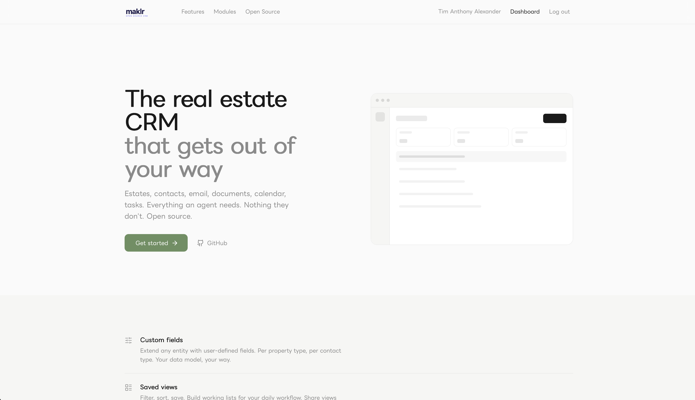
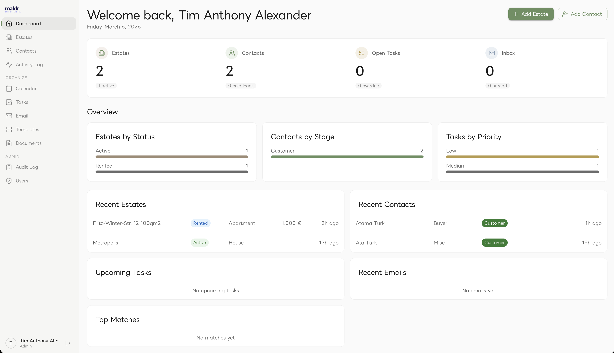
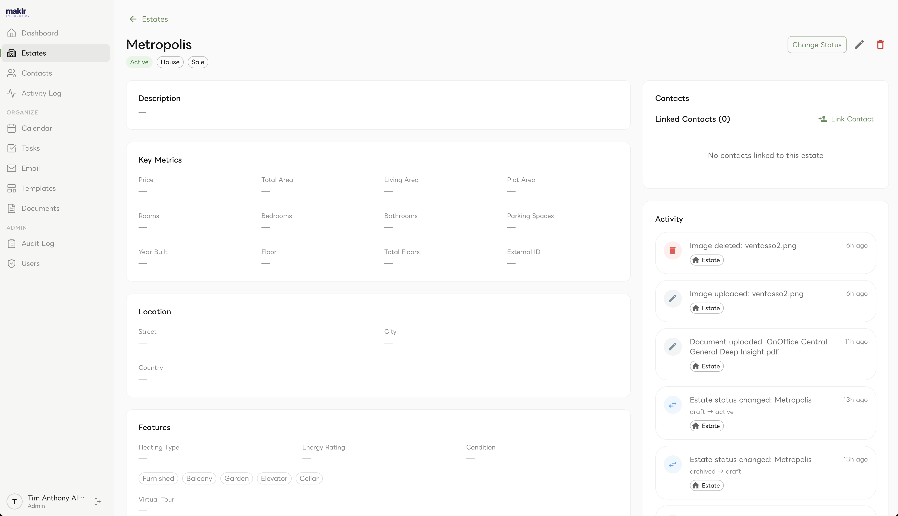
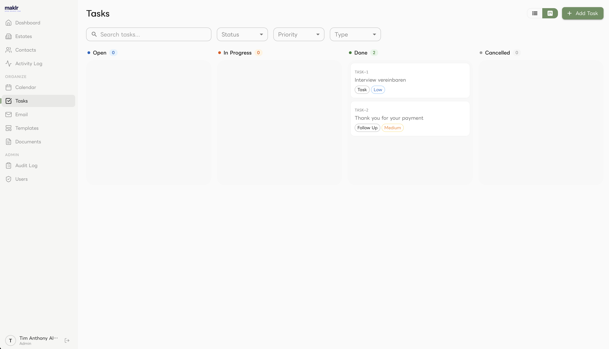
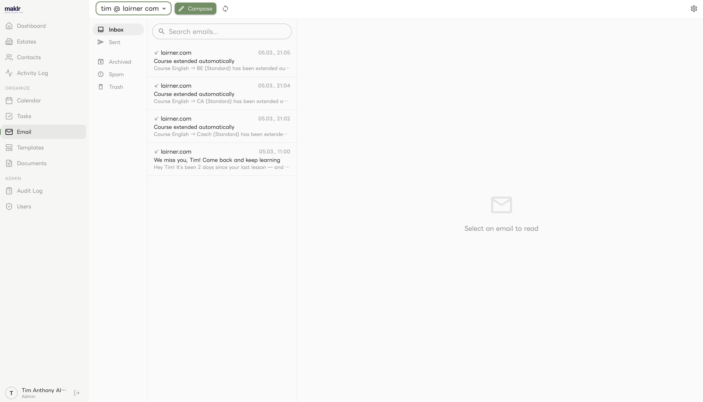
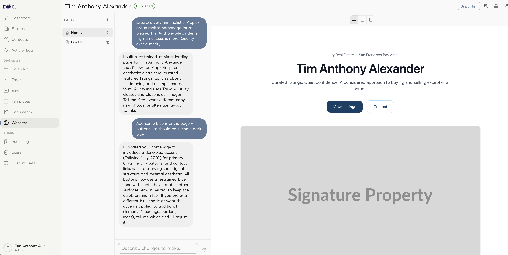

<p align="center">
  
  <br />
  <br />
  Open-source real estate CRM for modern brokerages.
  <br />
  Built with PHP 8.4 &amp; React 19.
</p>

<p align="center">
  <a href="#quick-start">Quick Start</a> &middot;
  <a href="#features">Features</a> &middot;
  <a href="docs/MVP.md">Roadmap</a> &middot;
  <a href="#contributing">Contributing</a>
</p>

---

## Why Maklr?

Commercial real estate CRMs are expensive, closed-source, and lock you in. Maklr gives brokerages a self-hosted alternative with the features that actually matter — property management, contact matching, activity tracking, and email integration — without the vendor lock-in.

---

## Screenshots

<p align="center">
  
</p>

<p align="center">
  
</p>

<p align="center">
  
</p>

<p align="center">
  
</p>

<p align="center">
  
</p>

<p align="center">
  
</p>

**AI Website Builder** — Create and manage public-facing websites directly from the CRM. Each website consists of pages with AI-generated HTML content powered by an integrated LLM chat interface. Describe what you want in natural language, and the AI generates responsive, Tailwind-styled pages following a clean minimalist design. Edit iteratively through conversation — the chat history provides context for follow-up changes. Includes daily rate limiting per office and HTML sanitization for safe output.

---

## Quick Start

**Prerequisites:** PHP 8.4+, MySQL, Redis, Bun, Composer

```bash
git clone https://github.com/timanthonyalexander/maklr.git && cd maklr

# Install & configure
composer install
cp .env.example .env        # then edit with your DB & mail credentials

# Database
./mason migrate:generate && ./mason migrate:apply -y

# Start backend (http://localhost:7272)
./mason serve

# Start frontend (http://localhost:7273)
cd web && bun install && bun run dev
```

---

## Features

> `[x]` Shipped — `[-]` In progress — `[ ]` Planned

### Core Modules

**Estates** `[-]`
Full property CRUD — apartments, houses, commercial, land, garage. Sale, rent, and lease marketing types. Status lifecycle (draft, active, reserved, sold/rented, archived), image and floor plan uploads with reordering, virtual tour URLs, owner linking, agent assignment, saved filters. Remaining: geo data map view, custom fields UI, bulk actions, quick search expansion.

**Contacts** `[-]`
Buyers, sellers, tenants, landlords, service providers. Pipeline stages (cold, warm, hot, deal, lost), GDPR consent handling, file attachments, saved filters, activity log. Remaining: search profiles UI, matching engine, relationship management UI, duplicate merging.

**Activity Log** `[x]`
Unified timeline per estate and contact. Auto-logged emails, status changes, uploads, appointments, and task completions. Manual entries for calls, meetings, notes, and viewings. Type and date range filters.

**Calendar** `[x]`
Appointments linked to estates, contacts, and users. Day, week, and month views. Conflict detection with warnings. Types: viewing, meeting, handover, internal, other.

**Tasks** `[x]`
Task management with title, description, due date, priority, and assignees. Linked to estates and contacts. Comments. List view and kanban board toggle.

**Email** `[x]`
Connect external mailboxes via IMAP/SMTP. Send and receive in-app. Auto-match emails to contacts, archive to activity log. File attachments. Create tasks from emails.

**Email Templates** `[x]`
Template CRUD with placeholder variables for estate and contact fields. Live preview with substitution.

**AI Website Builder** `[x]`
Create and manage public-facing websites with AI-generated pages. Chat-based editing interface — describe changes in natural language and the LLM generates responsive, Tailwind-styled HTML. Iterative conversation with full chat history context. Per-office daily rate limiting and HTML sanitization. Website listing with search, pagination, and publish/draft status.

**Documents** `[-]`
File storage per entity (estate, contact, appointment). Upload, download, and delete with permission checks. Remaining: PDF brochure generation.

**Users & Auth** `[x]`
Roles (admin, manager, agent, readonly, api_user). Per-module RBAC, multi-office support, API token auth, team invitations, onboarding flow. Remaining: audit log persistence, record ownership scopes.

### Roadmap

**Multi-Property** `[ ]`
Master properties with child units for complexes and new builds.

**Portal Syndication** `[ ]`
OpenImmo XML export, per-portal publish toggles, FTP/API push with sync status.

**Workflow Automation** `[ ]`
Step-based workflow builder with triggers, conditions, and actions. Automate acquisition, lead nurturing, and after-sales sequences.

**Invoicing** `[ ]`
Invoice CRUD, commission calculation, PDF generation, time tracking.

**Dashboards & Stats** `[ ]`
Configurable widgets — inventory, pipeline, conversion funnel, agent performance.

**Public API** `[ ]`
Read-only endpoints for published estates, lead capture, prospect finder, webhooks.

**Phone / CTI** `[ ]`
Click-to-call, SIP/WebRTC browser calling, caller ID lookup.

**Internal Messaging** `[ ]`
User-to-user messages, company announcements, notification center.

**Mobile App** `[ ]`
Property browsing, contact lookup, appointments with navigation, offline checklists, photo capture.

---

## Tech Stack

| Layer | Technology |
|-------|------------|
| **Backend** | PHP 8.4, [BaseAPI](https://github.com/timanthonyalexander/base-api), MySQL, Redis |
| **Frontend** | React 19, TypeScript, MUI v7, Vite 7 |
| **Package Managers** | Bun (frontend), Composer (backend) |
| **Testing** | PHPUnit, SQLite in-memory isolation |

---

## Development

### Backend

```bash
./mason serve                    # Dev server
./mason serve --screen           # In screen session

./mason migrate:generate         # Generate migrations from model changes
./mason migrate:apply -y         # Apply migrations

composer phpunit                 # Run tests
composer phpstan                 # Static analysis
composer rector                  # Code quality (dry run)
composer rector:fix              # Apply fixes
```

### Frontend

```bash
cd web
bun run dev                      # Dev server
bun run build                    # Production build
bun run lint                     # Lint check
bun run fix                      # Lint + format fix
```

### Testing

```bash
composer phpunit                        # All tests
composer phpunit -- tests/Unit          # Unit only
composer phpunit -- tests/Feature       # Integration only
```

### Git Hooks

Pre-commit hooks run automatically — PHP syntax, PHPStan, PHPUnit, debug function detection, large file warnings. Reinstall with `composer setup-hooks`.

---

## Contributing

Contributions are welcome, especially for planned modules. Please open an issue to discuss larger changes before submitting a PR.

---

## License

TBD
